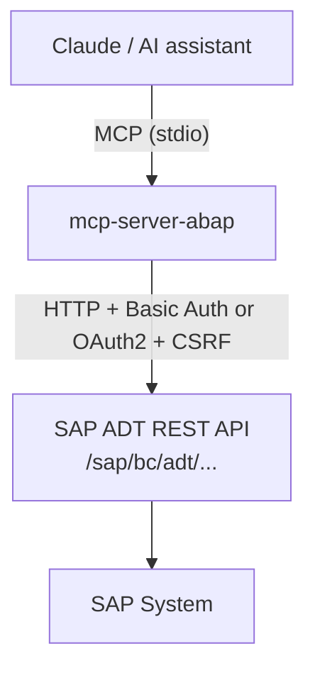

# mcp-server-abap

A community-built [MCP (Model Context Protocol)](https://modelcontextprotocol.io) server that lets AI assistants like Claude read, write, and manage ABAP source code on SAP systems — directly from the editor.

> **Community project.** This project is not affiliated with, endorsed by, or supported by SAP SE. SAP and ABAP are trademarks of SAP SE.

---

## How it works

The server connects to your SAP system via the **SAP ADT (ABAP Development Tools) REST API** — the same HTTP API that ABAP Development Tools for Eclipse uses under the hood. No SAP GUI, no RFC, no additional middleware required.



## Available tools (40)

<details>
<summary><strong>Source code</strong> (5 tools)</summary>

| Tool | Description |
|------|-------------|
| `get_source` | Read ABAP source code of any object |
| `set_source_from_file` | Write ABAP source from a local file |
| `patch_source` | Apply incremental edits to source code |
| `pretty_print` | Format ABAP source code using SAP Pretty Printer |
| `get_completions` | Get code completion proposals at a cursor position |
| `rename` | Rename a variable, method, or symbol with automatic reference updates |

</details>

<details>
<summary><strong>Objects and packages</strong> (6 tools)</summary>

| Tool | Description |
|------|-------------|
| `search_objects` | Search for objects by name pattern and type |
| `where_used` | Find all usages of an object |
| `navigate_to_definition` | Go to definition of a source reference |
| `browse_package` | List contents of a package |
| `get_object_info` | Get object metadata (type, package, description) |
| `get_table_fields` | Get DDIC table/structure field definitions |
| `create_object` | Create a new ABAP object (program, class, interface) |
| `delete_object` | Delete an ABAP object |

</details>

<details>
<summary><strong>Locking and activation</strong> (4 tools)</summary>

| Tool | Description |
|------|-------------|
| `lock_object` | Lock an object for editing, returns a lock handle |
| `unlock_object` | Unlock a previously locked object |
| `activate_object` | Activate a single ABAP object |
| `activate_objects` | Activate multiple objects at once |

</details>

<details>
<summary><strong>Testing and quality</strong> (4 tools)</summary>

| Tool | Description |
|------|-------------|
| `syntax_check` | Run a syntax check |
| `verify_source` | Syntax-check ABAP source without an existing object |
| `run_unit_tests` | Run ABAP Unit Tests |
| `run_atc_check` | Run ATC (ABAP Test Cockpit) checks |
| `get_atc_customizing` | Get ATC check variant configuration |
| `get_abap_doc` | Look up ABAP keyword documentation |

</details>

<details>
<summary><strong>Transport management</strong> (2 tools)</summary>

| Tool | Description |
|------|-------------|
| `get_transport_requests` | List open or released transport requests |
| `add_to_transport` | Assign an object to a transport request |

</details>

<details>
<summary><strong>Export</strong> (3 tools)</summary>

| Tool | Description |
|------|-------------|
| `export_package` | Export an ABAP package as abapGit ZIP or folder ([requires companion](https://github.com/Hochfrequenz/Z_ABABGIT_ADT_EXPORT)) |
| `export_packages` | Bulk export with wildcard patterns and include/exclude filters |
| `export_customizing` | Export all customizing tables to SQLite + JSON (read-only, ~16K tables with `customer_only`) |

</details>

<details>
<summary><strong>Debugging</strong> (10 tools)</summary>

| Tool | Description |
|------|-------------|
| `debug_start` | Start a debug session |
| `debug_stop` | Stop a debug session |
| `debug_attach` | Attach to a running debug session |
| `debug_step` | Step into/over/out in debugger |
| `debug_set_breakpoint` | Set a breakpoint |
| `debug_remove_breakpoint` | Remove a breakpoint |
| `debug_set_watchpoint` | Set a watchpoint on a variable |
| `debug_get_variable` | Read a variable value |
| `debug_get_stack` | Get the call stack |
| `debug_get_sessions` | List active debug sessions |

</details>

<details>
<summary><strong>System</strong> (1 tool)</summary>

| Tool | Description |
|------|-------------|
| `select_system` | Switch the active SAP system (multi-system config) |

</details>

## Requirements

- SAP NetWeaver 7.40+ with ADT services active (transaction SICF: `/sap/bc/adt`)
- A user with developer authorizations (`S_ADT_RES`, `S_DEVELOP`) — or OAuth2 SSO (see below)
- Go 1.26+ (to build from source)

## Getting started

### 1. Download the binary

Download the latest release for your platform from the [releases page](https://github.com/Hochfrequenz/mcp-server-abap/releases):

| Platform | File |
|----------|------|
| Windows | `mcp-server-abap-*-windows-amd64.zip` |
| macOS (Intel) | `mcp-server-abap-*-darwin-amd64.tar.gz` |
| macOS (Apple Silicon) | `mcp-server-abap-*-darwin-arm64.tar.gz` |
| Linux | `mcp-server-abap-*-linux-amd64.tar.gz` |

Extract the archive. You'll get a single `mcp-server-abap` executable (or `mcp-server-abap.exe` on Windows).

### 2. Create `config.yaml`

Create a file called `config.yaml` next to the binary (or anywhere you like):

```yaml
default_system: dev

systems:
  dev:
    host: "https://your-sap-system:8000"
    user: "YOUR_USER"
    password: "YOUR_PASSWORD"
    client: "100"
    tls_skip_verify: false
```

### 3. Connect to Claude

See [Usage with Claude](#usage-with-claude) below for copy-paste configuration snippets.

### Alternative: Docker

```bash
docker pull ghcr.io/hochfrequenz/mcp-server-abap:latest
docker run -i -v ./config.yaml:/config.yaml -e SAP_CONFIG_FILE=/config.yaml ghcr.io/hochfrequenz/mcp-server-abap
```

### Alternative: Build from source

Requires Go 1.26+:

```bash
git clone https://github.com/Hochfrequenz/mcp-server-abap.git
cd mcp-server-abap
go build -o mcp-server-abap .
```

## Configuration

Copy the example config and fill in your SAP system details:

```bash
cp config.yaml.example config.yaml
```

```yaml
default_system: dev

systems:
  dev:
    host: "https://your-dev-system:8000"
    user: "YOUR_USER"
    password: "YOUR_PASSWORD"
    client: "100"          # optional, omit to use SAP default client
    tls_skip_verify: false
  prod:
    host: "https://your-prod-system:8000"
    user: "YOUR_USER"
    password: "YOUR_PASSWORD"
```

### OAuth2 / SSO

For systems with SAML SSO, omit `user` and `password` to use OAuth2:

```yaml
systems:
  prod:
    host: "https://your-prod-system:8000"
    # no user/password → OAuth2 mode
    oauth2_client_id: "mcp-server-abap"  # optional, this is the default
```

Then authenticate via browser before starting the server:

```bash
mcp-server-abap login prod
```

This opens your browser for SAML authentication. After login, tokens are cached in `~/.config/mcp-server-abap/tokens.json` and refreshed automatically.

**SAP prerequisites:** Register OAuth2 client `mcp-server-abap` in transaction `SOAUTH2` with grant type "Authorization Code" and redirect URI pattern `http://localhost:*`. SAML IdP trust must be configured in transaction `SAML2`.

Alternatively, configure via environment variables:

| Variable | Description |
|----------|-------------|
| `SAP_CONFIG_FILE` | Path to config.yaml (default: `./config.yaml`) |

## Usage with Claude

### Claude Desktop

Add to your `claude_desktop_config.json`:

```json
{
  "mcpServers": {
    "abap": {
      "command": "/path/to/mcp-server-abap",
      "args": [],
      "env": {
        "SAP_CONFIG_FILE": "/path/to/config.yaml"
      }
    }
  }
}
```

### Claude Code (CLI)

Add to your Claude Code MCP settings or run directly:

```bash
SAP_CONFIG_FILE=/path/to/config.yaml mcp-server-abap
```

## Example workflow

Once connected, Claude can:

```
You: Show me the source of class ZCL_MY_SERVICE
Claude: [calls get_source] Here's the source...

You: Fix the bug in method GET_DATA and activate the class
Claude: [calls lock_object, patch_source, activate_object, unlock_object] Done. Activation succeeded.

You: Run the unit tests for this class
Claude: [calls run_unit_tests] 5 tests passed, 0 failed.
```

## Logging

Logs go to stderr by default (text format). Configure via environment variables:

| Variable | Default | Description |
|----------|---------|-------------|
| `LOG_FORMAT` | `text` | `text` or `json` |
| `LOG_LEVEL` | `info` | `debug`, `info`, `warn`, `error` |
| `PAPERTRAIL_HOST` | — | Papertrail syslog host (e.g. `logs5.papertrailapp.com`) |
| `PAPERTRAIL_PORT` | — | Papertrail syslog port (e.g. `12345`) |

### Papertrail setup

To send logs to [Papertrail](https://www.papertrail.com/):

1. Create a Papertrail account and set up a **Log Destination** (Settings > Log Destinations)
2. Note the host and port (e.g. `logs5.papertrailapp.com:12345`)
3. Set the environment variables before starting the server:

```bash
export PAPERTRAIL_HOST=logs5.papertrailapp.com
export PAPERTRAIL_PORT=12345
SAP_CONFIG_FILE=config.yaml ./mcp-server-abap
```

Logs are sent over TLS. Both stderr and Papertrail receive every log event.

## Development

### Unit tests

```bash
go test ./...
```

### Integration tests

Integration tests run against a real SAP system and are excluded from CI.
They require the `integration` build tag and SAP credentials:

```bash
cp .env.example .env   # fill in your credentials
source .env
go test -tags integration ./adt/...
```

See `testdata/integration_objects.md` for required SAP test fixtures.

## Contributing

Issues and pull requests welcome. This is a community project — if your SAP system exposes additional ADT endpoints you'd like to see supported, open an issue.

## License

MIT
