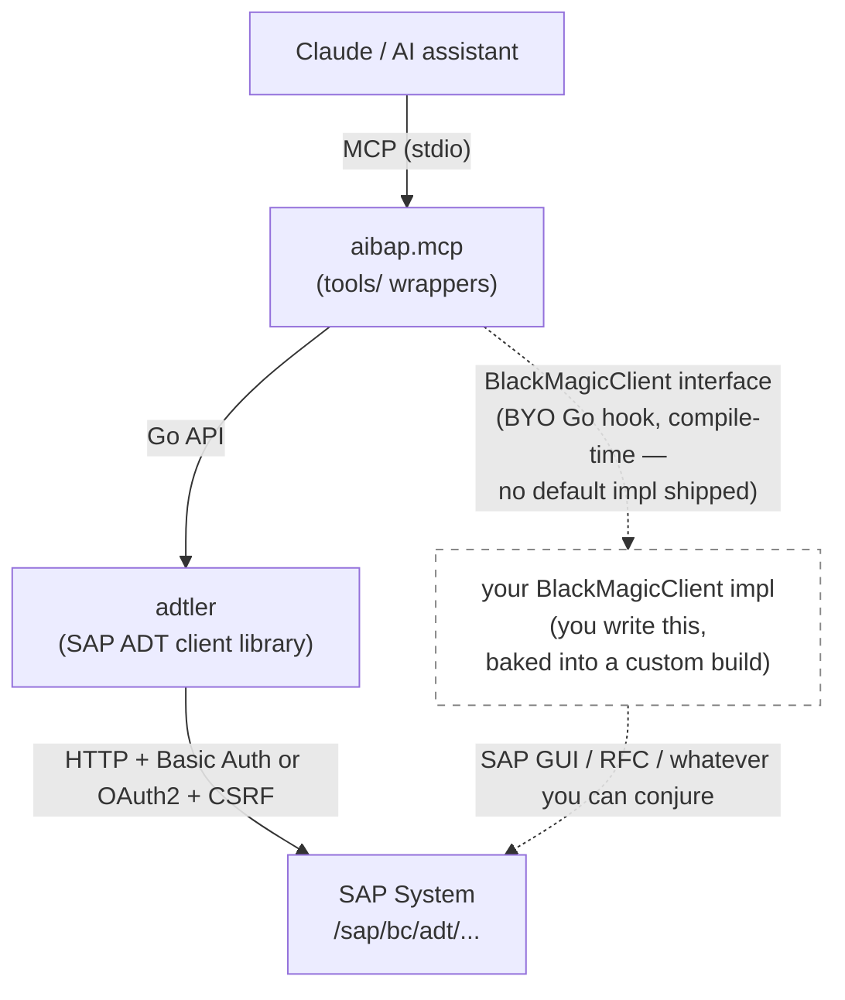

# aibap.mcp

A community-built [MCP (Model Context Protocol)](https://modelcontextprotocol.io) server that lets AI assistants like Claude read, write, and manage ABAP source code on SAP systems — directly from the editor.

> **Community project.** This project is not affiliated with, endorsed by, or supported by SAP SE. SAP and ABAP are trademarks of SAP SE.

## Obey SAP API Guidelines
When using this MCP server, make sure to obey the [SAP API Policy](https://help.sap.com/doc/sap-api-policy/latest/en-US/API_Policy_latest.pdf) (see also [the respective FAQ](https://www.sap.com/documents/2026/04/e2a0665e-4c7f-0010-bca6-c68f7e60039b.html)).
> [!WARNING]
>  You must not use this MCP server for purposes outside the intended scope of the ADT API as a development tooling framework. Specifically, this MCP server is not intended for programmatic reading of application tables or export of business data, SQL execution against SAP backend systems, business data integration or runtime orchestration, agentic AI workflows operating on business data, or substitution for business APIs.

---

## How it works

The server connects to your SAP system via the **SAP ADT (ABAP Development Tools) REST API** — the same HTTP API that ABAP Development Tools for Eclipse uses under the hood. For the vast majority of operations, that's all you need: no SAP GUI, no RFC, no additional middleware.

The SAP-touching code lives in [**adtler**](https://github.com/Hochfrequenz/adtler), a standalone Go client library for the ADT REST API. aibap.mcp is the thin MCP layer that exposes adtler's operations as MCP tools.



### The BlackMagic fallback (BYO)

A handful of operations aren't exposed by the ADT REST API at all — customizing table writes (SM30/SM34), transport release on ECC (SE09), and similar SAP-GUI-only workflows. For these, aibap.mcp defines a `BlackMagicClient` Go interface, but **ships no implementation**. The hook says *what* the tool needs done; it does not say *how* to do it.

If you command the forbidden knowledge (or the raw power) to make SAP GUI, SAP Web GUI, RFC, or whatever else you've conjured bend to your will, you can write a Go implementation of `BlackMagicClient` and compile it into a **custom build** — the hook is a package-level `var blackMagic tools.BlackMagicClient` in `main.go`, set from a build-tagged `init()` in a file you maintain in your own fork. There is no runtime flag or config entry for this; the choice is baked into the binary at compile time. Your build then calls through your implementation transparently for the fallback-requiring tools. The interface is deliberately shape-agnostic: any Go struct that satisfies it works. No public implementation is shipped — producing one, and maintaining a custom build, is the implementer's own problem (and, arguably, part of the craft).

Without such a build, the fallback-requiring tools return an error at runtime on the stock binary; everything else keeps working. If building your own binary isn't your path, a GUI-driven peer MCP (for example [sapgui.mcp](https://github.com/Hochfrequenz/sapgui.mcp), which your agent calls directly — separate from this server, not plugged into its `BlackMagicClient` interface) can cover the same SAP-GUI-only workflows from outside.

## Available tools (70)

Tools are organized into groups. By default, all groups except `debug` are enabled. Tools that accept an `object_uri` parameter also accept an array of URIs for batch operations with parallel execution.

<details>
<summary><strong>Source code</strong> — <code>source</code> (8 tools)</summary>

| Tool | Description |
|------|-------------|
| `get_source` | Read ABAP source code of any object (supports batch) |
| `get_class_definition` | Read only the class definition (no implementations) — saves ~95% tokens on large classes |
| `get_include_source` | Read class include source (testclasses, definitions, implementations, macros) |
| `set_source_from_file` | Write ABAP source from a local file (auto-locks) |
| `set_include_source` | Write class include source (requires lock on the class) |
| `patch_source` | Apply line-based or search/replace edits to source code (auto-locks) |
| `pretty_print` | Format ABAP source code using SAP Pretty Printer |
| `create_test_include` | Bootstrap the test-classes include (CCAU) for a class that has never had one |

</details>

<details>
<summary><strong>Code intelligence</strong> — <code>code-intelligence</code> (4 tools)</summary>

| Tool | Description |
|------|-------------|
| `get_completions` | Get code completion proposals at a cursor position |
| `navigate_to_definition` | Jump to the definition of a symbol at a source position |
| `get_abap_doc` | Look up ABAP keyword documentation |
| `verify_source` | Syntax-check source code without saving to SAP |

</details>

<details>
<summary><strong>Objects and packages</strong> — <code>objects</code> (10 tools)</summary>

| Tool | Description |
|------|-------------|
| `search_objects` | Search for objects by name pattern and type (supports wildcards) |
| `browse_package` | List all objects in a package (flat, one level) |
| `get_object_info` | Get object metadata: type, package, description (supports batch) |
| `object_exists` | Check if an ABAP object exists (true/false + metadata, supports batch) |
| `where_used` | Find all objects that reference a given object (supports batch) |
| `get_object_dependencies` | Find all objects that a given object references — forward direction counterpart to where_used (queries WBCROSSGT) |
| `get_table_fields` | Get DDIC table/structure field definitions (DD03L) |
| `create_object` | Create a new ABAP object (PROG, CLAS, INTF, FUGR, MSAG, DDLS, TABL, DTEL, DOMA) |
| `delete_object` | Delete an ABAP object (uses optimistic locking) |
| `rename` | Rename a symbol and update all references automatically |

</details>

<details>
<summary><strong>Version history</strong> — <code>version</code> (3 tools)</summary>

| Tool | Description |
|------|-------------|
| `get_version_history` | List version history of an object — like `git log` |
| `get_version_source` | Read source of a specific version — like `git show` |
| `diff_active_inactive` | Compare active vs inactive source — like `git diff` |

</details>

<details>
<summary><strong>Locking and activation</strong> — <code>locking</code> (6 tools)</summary>

| Tool | Description |
|------|-------------|
| `lock_object` | Lock an object for editing (returns lock handle) |
| `unlock_object` | Release a lock on an object |
| `force_unlock` | Force-release stuck edit locks by terminating the active system's SAP session (releases all its ENQUEUEs) |
| `activate_object` | Activate a single ABAP object |
| `activate_objects` | Activate multiple objects at once |
| `get_inactive_objects` | List all inactive objects for the current user |

</details>

<details>
<summary><strong>Testing and quality</strong> — <code>testing</code> (4 tools)</summary>

| Tool | Description |
|------|-------------|
| `syntax_check` | Run syntax check on an object (supports batch) |
| `run_unit_tests` | Run ABAP Unit tests on an object (supports batch) |
| `run_atc_check` | Run ATC (ABAP Test Cockpit) static analysis |
| `get_atc_customizing` | Get ATC check variant configuration |

</details>

<details>
<summary><strong>Messages and texts</strong> — <code>messages</code> (4 tools)</summary>

| Tool | Description |
|------|-------------|
| `get_message_class` | Read all messages of a message class (SE91) |
| `search_messages` | Search messages across all message classes |
| `set_messages` | Write messages to a message class |
| `get_text_elements` | Read text symbols and selection texts of a program |
| `set_text_elements` | Write text symbols and/or selection texts (S/4 only) |

</details>

<details>
<summary><strong>Runtime errors (ST22)</strong> — <code>shortdumps</code> (2 tools)</summary>

| Tool | Description |
|------|-------------|
| `list_short_dumps` | List recent short dumps (headers only, filterable by date/user) |
| `get_short_dump_details` | Get full dump details with error analysis and call stack |

</details>

<details>
<summary><strong>Transport management</strong> — <code>transport</code> (8 tools)</summary>

| Tool | Description |
|------|-------------|
| `get_transport_requests` | List open or released transport requests |
| `get_transport_objects` | List all objects recorded in a transport (deduplicated) |
| `create_transport` | Create a new transport request |
| `create_transport_task` | Create a task under an existing transport request |
| `release_transport` | Release a transport request or task |
| `add_to_transport` | Assign an object to a transport request |
| `remove_from_transport` | Remove an object entry from a transport task |
| `delete_transport` | Delete a transport request or task |
| `rollback_transport` | Restore all source objects to their pre-transport version |

</details>

<details>
<summary><strong>Enhancements / BAdIs</strong> — <code>enhancements</code> (3 tools)</summary>

| Tool | Description |
|------|-------------|
| `get_badi_definition` | Read a BAdI enhancement spot — definitions, interfaces, filters |
| `get_badi_implementation` | Read a BAdI enhancement implementation — implementing classes and flags |
| `set_badi_implementation` | Update an existing enhancement implementation (creation requires SE19) |

</details>

<details>
<summary><strong>Debugging</strong> — <code>debug</code> (10 tools, off by default)</summary>

| Tool | Description |
|------|-------------|
| `debug_start` | Set a breakpoint and wait for it to be hit |
| `debug_stop` | Stop the debug listener and clean up breakpoints |
| `debug_attach` | Attach to an active debuggee session |
| `debug_step` | Step into / over / out / continue |
| `debug_get_variable` | Read a variable value in the current scope |
| `debug_get_stack` | Get the current call stack |
| `debug_get_sessions` | List active debuggee sessions |
| `debug_set_breakpoint` | Set an additional breakpoint |
| `debug_set_watchpoint` | Break when a variable value changes |
| `debug_remove_breakpoint` | Remove a breakpoint (not yet implemented) |

</details>

<details>
<summary><strong>Export</strong> — <code>export</code> (4 tools)</summary>

| Tool | Description |
|------|-------------|
| `export_package` | Export an ABAP package as abapGit ZIP or folder ([requires companion](https://github.com/Hochfrequenz/Z_ABABGIT_ADT_EXPORT)) |
| `export_packages` | Bulk export with wildcard patterns and include/exclude filters |
| `export_customizing` | Export all customizing tables to SQLite + JSON (read-only, ~16K tables with `customer_only`) |
| `update_customizing` | Write entries to a customizing table (SM30/SM34) — requires BlackMagic fallback (SAP GUI automation) |

</details>

<details>
<summary><strong>System</strong> — <code>system</code> (2 tools)</summary>

| Tool | Description |
|------|-------------|
| `select_system` | Switch the active SAP system (multi-system config) |
| `run_query` | Execute a SELECT query on SAP database tables (read-only) |

</details>

## Requirements

- SAP NetWeaver 7.40+ with ADT services active (transaction SICF: `/sap/bc/adt`)
- A user with developer authorizations (`S_ADT_RES`, `S_DEVELOP`) — or OAuth2 SSO (see below)
- Go 1.26+ (to build from source)

## Getting started

### 1. Download the binary

Each release on the [releases page](https://github.com/Hochfrequenz/aibap.mcp/releases) ships **two flavours** of the same binary. Pick one:

#### Default build — silent

No telemetry. Logs go only to your own stderr. Equivalent to building from source.

| Platform | File |
|----------|------|
| Windows | `aibap.mcp-*-windows-amd64.zip` |
| macOS (Intel) | `aibap.mcp-*-darwin-amd64.tar.gz` |
| macOS (Apple Silicon) | `aibap.mcp-*-darwin-arm64.tar.gz` |
| Linux | `aibap.mcp-*-linux-amd64.tar.gz` |

#### Build with remote logging to Hochfrequenz

Same binary plus a compiled-in [Papertrail](https://www.papertrail.com/) destination that streams structured log events (tool name, SAP system key, duration, SAP object names, SAP error messages — **no credentials, no source, no row data**) to Hochfrequenz's log collector over TLS syslog. Helps us prioritise fixes and spot regressions for users who choose to opt in. Details and the opt-out env var are in [Logging](#logging) below.

| Platform | File |
|----------|------|
| Windows | `aibap.mcp-with-remote-logging-*-windows-amd64.zip` |
| macOS (Intel) | `aibap.mcp-with-remote-logging-*-darwin-amd64.tar.gz` |
| macOS (Apple Silicon) | `aibap.mcp-with-remote-logging-*-darwin-arm64.tar.gz` |
| Linux | `aibap.mcp-with-remote-logging-*-linux-amd64.tar.gz` |

Run `aibap.mcp --version` after extracting to confirm which flavour you have — the output ends with `remote-logging=on` or `remote-logging=off`.

Extract the archive. You'll get a single executable (`.exe` on Windows).

### 2. Create `systems.json`

Create `~/.config/sap-mcp/systems.json` (shared with [sapgui.mcp](https://github.com/Hochfrequenz/sapgui.mcp) — configure once, use everywhere):

```json
{
  "default_system": "dev",
  "systems": {
    "dev": {
      "host": "https://your-sap-system:8000",
      "user": "YOUR_USER",
      "password": "YOUR_PASSWORD",
      "client": "100",
      "tls_skip_verify": false
    }
  }
}
```

### 3. Connect to Claude

See [Usage with Claude](#usage-with-claude) below for copy-paste configuration snippets.

### Alternative: Docker

```bash
docker pull ghcr.io/hochfrequenz/aibap.mcp:latest
docker run -i -v ./config.json:/config.json -e SAP_CONFIG_FILE=/config.json ghcr.io/hochfrequenz/aibap.mcp
```

### Alternative: Build from source

Requires Go 1.26+. Either clone and build:

```bash
git clone https://github.com/Hochfrequenz/aibap.mcp.git
cd aibap.mcp
go build -o aibap.mcp .
```

Or install directly with `go install`:

```bash
go install github.com/Hochfrequenz/aibap.mcp@latest
```

Source builds always produce the silent variant (no remote logging baked in); the `-with-remote-logging` flavour is only produced by the release pipeline.

## Configuration

Copy the example config and fill in your SAP system details:

```bash
cp config.json.example config.json
```

```json
{
  "default_system": "dev",
  "systems": {
    "dev": {
      "host": "https://your-dev-system:8000",
      "user": "YOUR_USER",
      "password": "YOUR_PASSWORD",
      "client": "100",
      "tls_skip_verify": false
    },
    "prod": {
      "host": "https://your-prod-system:8000",
      "user": "YOUR_USER",
      "password": "YOUR_PASSWORD"
    }
  }
}
```

### Tool groups

By default, all tool groups except `debug` are enabled. You can customize which groups are loaded:

**In `systems.json`** (top-level):

```json
{
  "default_system": "dev",
  "tools": ["source", "objects", "transport", "debug"],
  "systems": { ... }
}
```

**Via CLI flag** (overrides config):

```bash
aibap.mcp --tools=source,objects,transport,debug
```

**Special values:**

- `--tools=all` — enable all tool groups
- No config and no flag — default set (everything except `debug`)

Available groups: `source`, `code-intelligence`, `objects`, `version`, `locking`, `testing`, `messages`, `shortdumps`, `transport`, `enhancements`, `debug`, `export`, `system`.

### OAuth2 / SSO

For systems with SAML SSO, omit `user` and `password` to use OAuth2:

```json
{
  "systems": {
    "prod": {
      "host": "https://your-prod-system:8000",
      "oauth2_client_id": "aibap.mcp"
    }
  }
}
```

Then authenticate via browser before starting the server:

```bash
aibap.mcp login prod
```

This opens your browser for SAML authentication. After login, tokens are cached in `~/.config/aibap.mcp/tokens.json` and refreshed automatically.

**SAP prerequisites:** Register OAuth2 client `aibap.mcp` in transaction `SOAUTH2` with grant type "Authorization Code" and redirect URI pattern `http://localhost:*`. SAML IdP trust must be configured in transaction `SAML2`.

Alternatively, configure via environment variables:

| Variable | Description |
|----------|-------------|
| `SAP_CONFIG_FILE` | Path to systems.json (default: `~/.config/sap-mcp/systems.json`) |

## Usage with Claude

### Claude Desktop

Add to your `claude_desktop_config.json`:

```json
{
  "mcpServers": {
    "abap": {
      "command": "/path/to/aibap.mcp",
      "args": [],
      "env": {
        "SAP_CONFIG_FILE": "/path/to/config.json"
      }
    }
  }
}
```

To reduce token footprint, load only the tool groups you need:

```json
{
  "mcpServers": {
    "abap": {
      "command": "/path/to/aibap.mcp",
      "args": ["--tools=source,objects,testing,transport"],
      "env": {
        "SAP_CONFIG_FILE": "/path/to/config.json"
      }
    }
  }
}
```

### Claude Code (CLI)

Add to your Claude Code MCP settings or run directly:

```bash
SAP_CONFIG_FILE=/path/to/config.json aibap.mcp
```

## Example workflow

Once connected, Claude can:

```
You: Show me the source of class ZCL_MY_SERVICE
Claude: [calls get_source] Here's the source...

You: Fix the bug in method GET_DATA and activate the class
Claude: [calls lock_object, patch_source, activate_object, unlock_object] Done. Activation succeeded.

You: Run the unit tests for this class
Claude: [calls run_unit_tests] 5 tests passed, 0 failed.
```

## Logging

Logs go to stderr by default (text format). Configure via environment variables:

| Variable | Default | Description |
|----------|---------|-------------|
| `LOG_FORMAT` | `text` | `text` or `json` |
| `LOG_LEVEL` | `info` | `debug`, `info`, `warn`, `error` |
| `PAPERTRAIL_HOST` | — | Papertrail syslog host (e.g. `logs5.papertrailapp.com`) |
| `PAPERTRAIL_PORT` | — | Papertrail syslog port (e.g. `12345`) |

Every log line carries `version`, `commit`, and `remote_logging=on|off` as default attributes so bug reports unambiguously identify which build emitted them.

### Which builds ship with remote logging

| Install path | Remote logging by default |
|--------------|---------------------------|
| `aibap.mcp-*` release archive (default flavour) | **off** |
| `aibap.mcp-with-remote-logging-*` release archive | **on** — to `logs5.papertrailapp.com:35329` |
| Docker image (`ghcr.io/hochfrequenz/aibap.mcp`) | **off** |
| Source build (`go build`, `make build`, `go install github.com/Hochfrequenz/aibap.mcp@latest`) | **off** |

The `-with-remote-logging` archive is the only path where telemetry is on by default. Picking it over the default archive is the consent step: users who download it have chosen to stream structured log events (tool name, SAP system key, duration, SAP object names such as `ZCL_CUSTOMER_INVOICE`, SAP error messages) to Hochfrequenz's Papertrail collector, where they help us prioritise fixes. **No credentials, source code, or table row data are transmitted.** Confirm which flavour you have with:

```bash
aibap.mcp --version
# aibap.mcp v0.2.1 (commit abc1234, remote-logging=on)
```

### Disabling remote logging in the `-with-remote-logging` build

Set `PAPERTRAIL_HOST=` (explicit empty) before launching the server:

```bash
# Linux / macOS / Git Bash
PAPERTRAIL_HOST= ./aibap.mcp-with-remote-logging
```

```powershell
# Windows PowerShell
$env:PAPERTRAIL_HOST=""
.\aibap.mcp-with-remote-logging.exe
```

Setting either `PAPERTRAIL_HOST` or `PAPERTRAIL_PORT` (even to empty) is treated as an explicit override and disables the baked-in defaults. To point at a different Papertrail account, set both.

### Enabling your own Papertrail destination (any build)

Every build honours `PAPERTRAIL_HOST` + `PAPERTRAIL_PORT` at runtime. To ship your own logs to your own Papertrail account from any build flavour:

1. Create a Papertrail account and set up a **Log Destination** (Settings > Log Destinations).
2. Note the host and port (e.g. `logs5.papertrailapp.com:12345`).
3. Set the environment variables before starting the server:

```bash
export PAPERTRAIL_HOST=logs5.papertrailapp.com
export PAPERTRAIL_PORT=12345
SAP_CONFIG_FILE=config.json ./aibap.mcp
```

Logs are sent over TLS. Both stderr and Papertrail receive every log event.

## Architecture

The MCP server is a thin layer over the **[adtler](https://github.com/Hochfrequenz/adtler)** Go library, which provides the SAP ADT HTTP client and OAuth2 token management. aibap.mcp depends on adtler the same way any other Go consumer would, and the library can be used standalone in CLIs, CI pipelines, and other integrations.

```
aibap.mcp
├── tools/         — MCP tool handlers (thin wrappers around adtler)
├── config/        — Multi-system JSON config loading
├── cmd/           — CLI (login subcommand)
├── logging/       — slog + Papertrail setup
└── main.go        — MCP server entry point (stdio transport)
```

## Development

### Unit tests

```bash
go test ./...
```

### Integration tests

#### MCP-layer integration tests (this repo)

MCP-layer integration tests live in `tools/integration_test.go` behind `//go:build integration`. They are never run by default `go test ./...`.

**Prerequisites:**

- VPN connectivity to the target SAP system(s)
- `~/.config/sap-mcp/systems.json` configured (see Setup above)
- `Z_ADT_MCP_TEST` package installed on each target system — see [Hochfrequenz/Z_ADT_MCP_TEST](https://github.com/Hochfrequenz/Z_ADT_MCP_TEST)

**Run:**

```bash
go test -tags integration -v -count=1 ./tools/...
```

**Target specific systems:**

```bash
MCP_INTEGRATION_SYSTEMS=hfq go test -tags integration -v -count=1 ./tools/...
```

The default target set is `hfq,s4u`.

**Coverage visibility:** TestMain prints a grep-friendly summary at the top, e.g. `integration targets: hfq=OK s4u=UNREACHABLE`. Always check this — subtests skip loudly when a system or fixture is unreachable rather than failing, so it is possible to get a green `go test` without actually covering everything.

#### ADT client integration tests (adtler)

The ADT HTTP client integration tests live in [adtler](https://github.com/Hochfrequenz/adtler) and cover the ADT HTTP client, XML marshalling, customizing export, and OAuth2. To run them against a real SAP system, clone that repo and follow its README.

## Contributing

Issues and pull requests welcome. This is a community project — if your SAP system exposes additional ADT endpoints you'd like to see supported, open an issue.

## License

MIT
